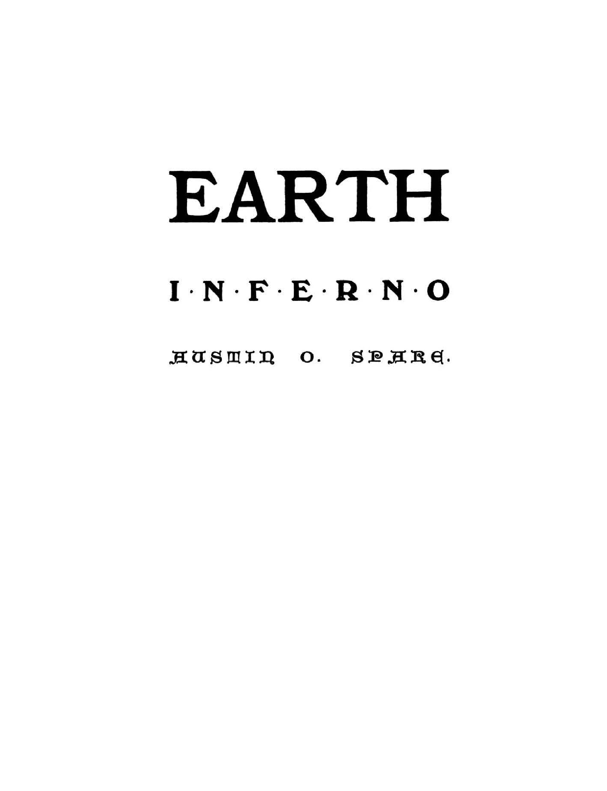

# オースティン・オスマン・スペアの『地上の地獄（Earth Inferno）』翻訳Zine（レビュー中🚧）

このZineは、オースティン・オスマン・スペアの『地上の地獄（Earth Inferno）』の全文を、要約訳（全訳ではない）したものです。

---

 

---

### 🇯🇵 『地上の地獄』 日本語訳と注釈

| セクション | 対象ページ | 内容・テーマ |リンク |
|------------|------------|------------------------------|--|
| **1. 書名と出版情報** | p.01〜p.03 | 署名と出版の情報 |[👉 1](section01.md)|
| **2. 書籍の情報** | p.04〜p.08 | 出版社の序文と本書の構成|[👉 2](section02.md)|
| **3. 宗教の欺瞞** | p.09〜p.12 | 教会・聖職者・儀式のパロディ。偽善と信仰の腐敗がテーマ |[👉 3](section03.md)|
| **4. 倫理と欲望の迷宮** | p.13〜p.17 | 教訓的な語りと矛盾する地獄の生活。マゾヒズムや自己欺瞞 |[👉 4](section04.md)|
| **5. 官僚機構と異常法体系** | p.18〜p.21 | 書類と行政による支配、堕落した合理性 |[👉 5](section05.md)|
| **6. 知識の地獄と教育制度** | p.22〜p.24 | 教育制度と知の暴力性。形式化された学問が魂を苦しめる |[👉 6](section06.md)|
| **7. 人間動物園／芸術と売春** | p.25〜p.27 | 展示される人間、商業化された創造行為 |[👉 7](section07.md)|
| **8. 最後の審判・地獄の市民** | p.28〜p.31 | 市民権・自由意志・秩序の地獄的再構築 |[👉 8](section08.md)|

---

### 🇬🇧 原文

👉 [クリックして読む](37355088-Austin-Osman-Spare-Earth-Inferno-1905-ocr.pdf)

---

📚『地上の地獄（Earth Inferno, 1905）』について 
『地上の地獄』は、オースティン・オスマン・スペアが20歳で自費出版した最初の著作であり、詩と図像が交錯する幻想的なアートブックである。ダンテ『神曲』に着想を得つつも、内容はスペア独自の魔術思想に満ちており、道徳や宗教への挑発と内的探求が、ページごとに濃密に展開される。視覚と言葉を通じた魔術的実践の先駆的表現といえるだろう。

本書では後年の主要概念「ZOS-KIA」ではなく、より原初的なかたちとして「ZOD-KIA」という語が用いられており、信仰・死・苦悩による支配的構造を象徴していると読み取れる。この「ZOD-KIA」は、後のスペアが構想した能動的・創造的統合体「ZOS-KIA」へと至る前段階として重要な概念であり、思想の進化を読み解く鍵ともなる。

---

🗃 関連資料

その他のオースティン・オスマン・スペアによる文書の翻訳Zineも公開中。
 
 
👉👉👉 [『快楽の書』(The Book of Pleasure)』を読む](https://github.com/ravensgate-tux/book_of_pleasure/blob/main/README.md) 
 
👉👉👉 [『ゾスの呪詛――偽善者たちへの説教 (Anathema of Zos)』を読む](https://github.com/ravensgate-tux/Anathema_of_Zos/blob/main/README.md)
 
 
👉👉👉 [『半獣人たちの書(A book of Satyes)』を読む](https://github.com/ravensgate-tux/book_satyrs/blob/main/README.md) 
 
📚『半獣神たちの書（A Book of Satyrs）』について 
本書は1907年に刊行されたオースティン・オスマン・スペアによる初期の画集であり、彼の特異な美学と魔術的想像力を色濃く映し出す図版が多数収録されている。**スペア自身による文章はもともと含まれていない**が、詩人であり私家版出版社「ペア・ツリー・プレス（Pear Tree Press）」の主宰でもあったジェームズ・ガスリー（James Guthrie）による序文が添えられており、当時の芸術的・社会的背景のもとにスペアの作品を位置づけている。
この序文は、スペアの絵画が持つサタイア（風刺）性や想像力、そして「予測不能な意図」に対して独自の評価を与えており、のちの『快楽の書』や『ゾスの呪詛』へと展開する思想の原型を、視覚芸術の面から捉える一助となるだろう。

---

## 🖼️ 出典クレジット

> ※この文書は Fulgur Limited (2007) が発行した 2007 年ファクシミリ版を底本とし、  
> 日本語訳および解説は Le Sorcier Inconnu により新たに加筆・編集されたものである。

---

## 🔖 免責・著作権に関する注意

本Zineは研究・学術・非営利目的で公開されており、出典を明記したうえで原文の部分引用・翻訳を行っています。

----

© 2025 知られざる呪術師（Le Sorcier Inconnu）
本ドキュメントは Creative Commons BY-SA 4.0 に基づき公開されています。

