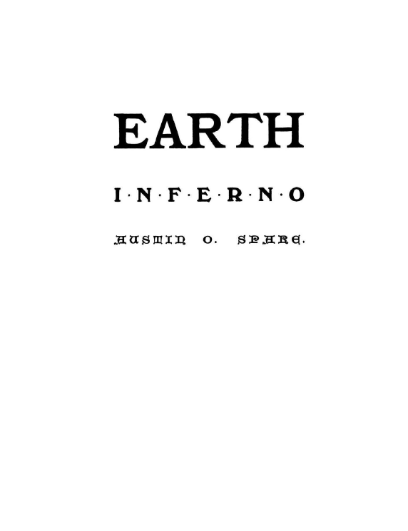
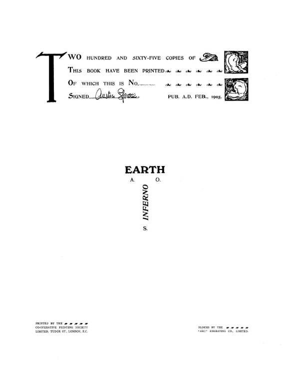

## セクション1

### 🐌 「知られざる呪術師」による注釈

※このセクションは挿絵のみで構成されているため、翻訳・注釈ともに設けていません。

---

## 🇬🇧　原文（原画像）

  
  
  

---

### 🇯🇵 翻訳と注記

#### if01.png：表紙

**EARTH INFERNO（地上の地獄）**  
著：オースティン・O・スペア

> ※ このページはタイトルページのため、翻訳は不要です。

---

#### if02.png：空白ページ

> ※ 内容なし（白紙）。図録・詩集によくある「対向ページ」としての空白。

---

#### if03.png：限定出版情報と奥付

この書は **1905年2月に出版**されたもので、限定**265部**印刷。  
署名付きの**私家版**であり、以下の情報が記されています：

- "TWO HUNDRED AND SIXTY-FIVE COPIES..."：265部限定
- "SIGNED — Austin Spare"：スペア本人のサイン入り
- "PUB. A.D. FEB., 1905."：1905年2月出版
- "PRINTED BY THE..."：ロンドンの印刷組合によって印刷
- "BLOCKS BY THE ZINC ETCHING CO., LIMITED."：図版は亜鉛版彫刻会社による製版

---

© 2025 知られざる呪術師（Le Sorcier Inconnu）  
本ドキュメントは [Creative Commons BY-SA 4.0](https://creativecommons.org/licenses/by-sa/4.0/deed.ja) に基づき公開されています。
