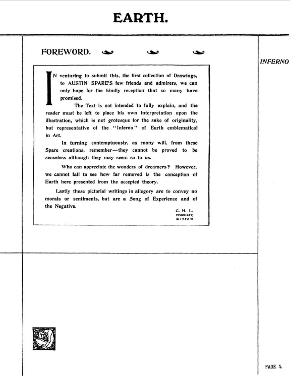
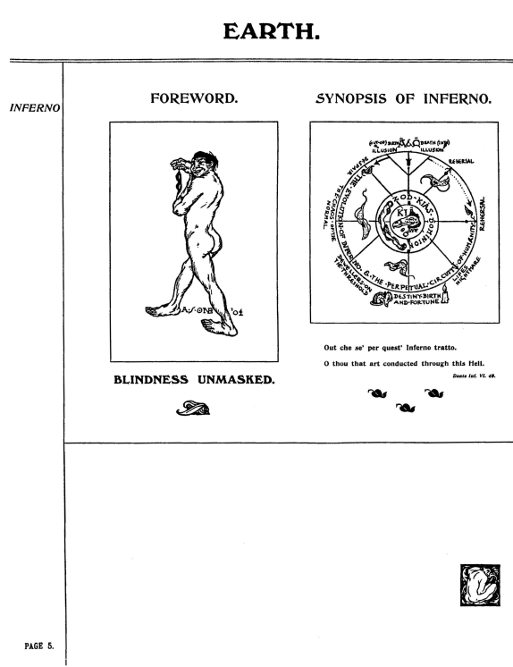
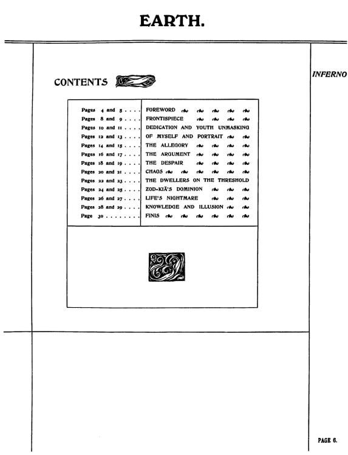
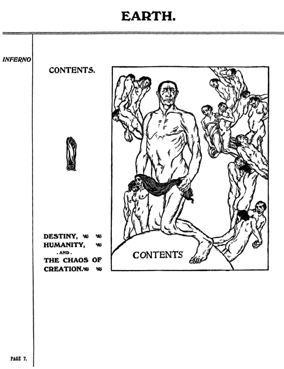
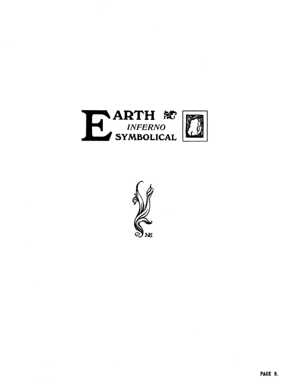

## セクション2：背徳の産業

## 🇬🇧　原文（原画像）

  
  
  
  
  

---

#### セクション2：背徳の産業

**タイトルの由来：** 図像と詩文で「労働」「性」「搾取」など、産業社会における人間の脱人格化がテーマとして描かれているため。

**主な根拠：**
- 画像：p.8–9「FRONTISPIECE」──裸で歩く労働者と、彼らに群がる小人のような人々
- テキスト：p.10–11「DEDICATION AND YOUTH UNMASKING」──青年期の自画像と「快楽なき享楽」の詩

---

### 🇯🇵 翻訳と注記

#### p.04〜p.08 背徳の産業の概要

このセクションは、産業化によって変容した地上の肉体的・精神的風景を描いた図像群で構成されている。

- **身体の拘束**：同じ姿勢で群れをなす裸の人々、屈曲し無表情な姿勢は、能動性の喪失を象徴している
- **性の徴候**：女性的な裸身や、匿名の群衆化された裸体は、「消費される存在」としての人間を暗示する
- **労働と無名性の象徴**：配置された視線やポーズは、無個性化された肉体群の様式美を強調する

スペアはここで、近代社会における「肉体の匿名性」と「快楽の制度化」への違和を、象徴的に表現している。

---

#### 🏛 p.04: 出版社による序文（全訳）

この最初の作品集を、オースティン・スペアのわずかな友人と賛美者に捧げるにあたり、多くの方々が示してくれた好意ある反応を、私たちはただ願うばかりです。

本書の文章は、図版を完全に解説する意図を持つものではなく、読者自身がそれぞれの解釈を行うべきものです。ここにある絵は、単に独創性のためにグロテスクであるのではなく、芸術における「地上の地獄（インフェルノ）」を象徴的に表したものです。

スペアのこれらの作品を見て多くの人が冷笑するかもしれませんが、たとえ我々には意味不明に見えたとしても、それが本当に無意味であると証明することはできません。

夢想家たちの驚異を理解できる者が、果たしてどれほどいるでしょう？とはいえ、ここで示されている「地球（アース）」の概念が、一般に受け入れられている理論とはいかにかけ離れているかは、否応なく目に入ってくるはずです。

最後に、本書の寓意的な図像は、道徳や感傷を伝えるものではなく、むしろ「体験」と「否定」の歌であることを申し添えておきます。

— C. H. L., 出版者、1905年

---

#### p.05 図像注釈 「地獄の概観（SYNOPSIS OF INFERNO）」

- このページは『Earth Inferno』全体の思想構造を象徴的に示す図解である

- p.5右図の中心にある“KIA”は、スペアが後年展開する「無限の根源存在」。個の超越、意志なき全体性を表す

- その周囲の“ZOD-KIA’S DOMINION”は、死と宿命による抑圧的秩序を象徴。のちの「ZOS-KIA」の前段階的表現

- 円環には7つの地獄的状態（幻想・死・転倒・予演・常態の地獄・宿命の循環・運命と誕生）が描かれ、人間存在が輪廻的な苦悩の構造に囚われていることを示す

- p.05の左の裸像は「盲目の仮面を剥がす者」。読者＝旅人への召喚と啓示の象徴

- 引用されたダンテの一節は、この“人生という地獄巡礼”の開始を告げる詩的合図である

- p.05は、『地上の地獄』の“思想マンダラ”であり、スペア宇宙観の原型図といえる

- スペアの時代（1900年代初頭）は産業革命の末期にあたり、階級・労働・性の抑圧がテーマとして社会に広まっていた

---

#### p.6 – TEXTUAL CONTENTS PAGE

このページは『地上の地獄（Earth Inferno）』の全体構成を示す「目次ページ」である。

- Foreword（序文） – p.4–5
- Frontispiece（図像詩） – p.8–9
- Dedication and Youth Unmasking – p.10–11
- Of Myself and Portrait – p.12–13
- The Allegory – p.14–15
- The Argument – p.16–17
- The Despair – p.18–19
- Chaos – p.20–21
- The Dwellers on the Threshold – p.22–23
- ZOD-KIA's Dominion – p.24–25
- Life’s Nightmare – p.26–27
- Knowledge and Illusion – p.28–29
- Finis – p.30

**注釈**

この目次構造は、単なるページガイドではなく、**スペアによる象徴的プロット構造**を示している可能性が高い。  
とくに「Despair」「Chaos」「ZOD-KIA’s Dominion」「Finis」などは、スペアの世界観の節目を象徴している。

---

#### p.7 – VISUAL CONTENTS

この図像は非常に象徴的で、中央の男性像を中心に、周囲に複数の人物が絡みつくように配置されている。

#### 🧍 中央の人物
- 一見して自信に満ちた裸体男性
- 右脚に布を巻いており、生殖器を隠している
- 「ZOS的身体」を象徴している可能性がある

#### 🔁 周囲の人物たち
- 多くは彼に絡みつく、あるいは倒れかけているような姿勢
- 肉体的欲望、精神的重圧、人間関係の束縛などを示唆

#### 🌀 下部の文言
> DESTINY, HUMANITY, AND THE CHAOS OF CREATION.

- これは、スペアにとってこの書が単なる「地獄図」ではなく、**運命・人間性・創造の混沌**という3つの軸で成立していることを示す
- p.6–7 は単なる「目次」ではなく、**スペアの思想構造を抽象的に提示する導入部**である  

---

© 2025 知られざる呪術師（Le Sorcier Inconnu）  
本ドキュメントは [Creative Commons BY-SA 4.0](https://creativecommons.org/licenses/by-sa/4.0/deed.ja) に基づき公開されています。
