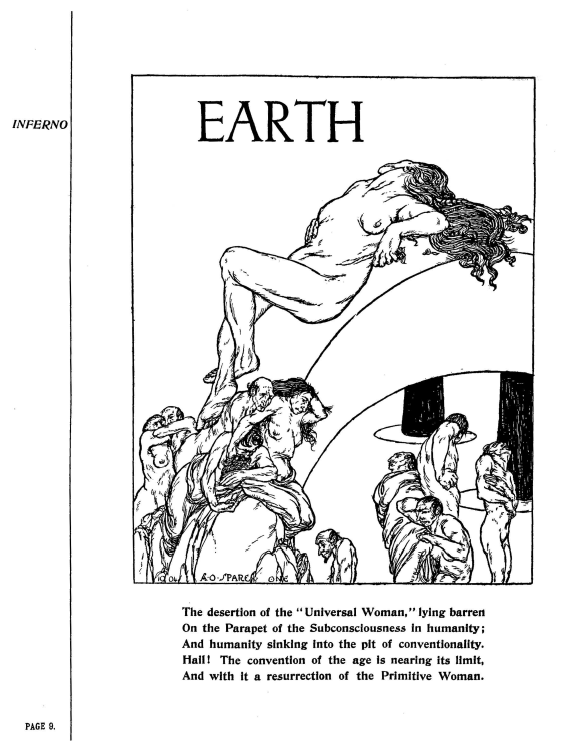
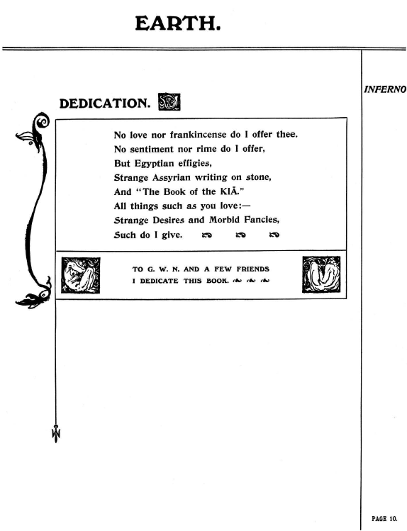
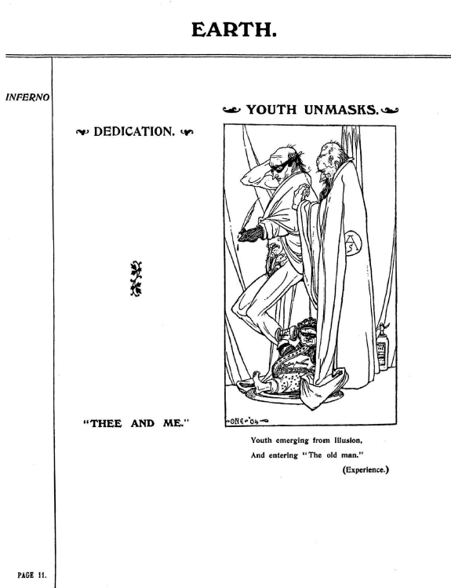
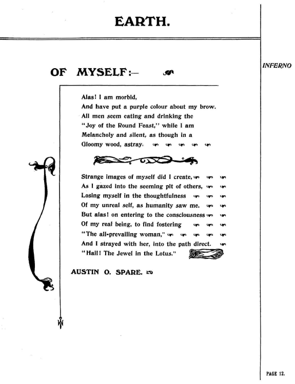

#### セクション3：宗教の欺瞞

#### 🇬🇧　原文（原画像）

  
  
  
  

---

#### セクション3：宗教の欺瞞

---

#### p.09： 普遍的女性（Universal Woman）

「普遍的女性」が見捨てられ 
人類の無意識の胸壁に、不毛のまま横たわっている 
人類は、慣習という深い奈落へと沈み込んでいく 

──見よ！時代の慣習はその終わりに近づいている 
やがてそこから、原初の女性が復活するのだ 

---

#### p.10： 献辞（DEDICATION）

私はあなたに愛も、乳香も捧げない 
感情も、詩も捧げない 
しかし、エジプトの像、奇妙なアッシリア文字の石碑、そして「KIA の書」を捧げる 
あなたが愛するすべてのもの 
奇妙な欲望と病的な空想 
それらをあなたに捧げる 

G. W. N. と数人の友人たちに 
この本を捧げる。 

---

#### p.11： Youth Unmasks（青年の仮面剥ぎ）

> Youth emerging from Illusion.  
> And entering “The old man.” (Experience.)

**訳と注記**  

青年が幻想から抜け出し  
「老人」（＝経験）へと歩み始める  
仮面は捨てられ、真の世界が見え始める

- 経験は老いではなく「深み」として肯定される
- 自己変容のイメージ

---

#### p.12： Of Myself（自己の告白）

**訳と注記**  

自らについて（OF MYSELF）  
ああ、私は病み  
額に紫の影を帯びてしまった  
人々は皆「円卓の喜び」を食し、飲み、歓楽に興じているが  
私は物憂げに沈黙し  
まるで暗い森を彷徨う者のようであった  

私は奇妙な自己像を創り出した――  
他者の深淵を覗き込むことで  
思索のうちに、幻想的な自己を見失っていき  
人類のように救われることもなかった  

だが、  
「遍在する女性（the all-prevailing woman）」の意識に至ったとき  
私は彼女と共に、まっすぐな道を歩みはじめたのだった  
  
  「ハイル！ 蓮に宿る宝石よ！」  
  
――オースティン・O・スペア  

**注記**
- 「紫の印象」はアウトサイダーとしての自己表象
- 「Jewel in the Lotus」は密教的マントラへの引用（Om Mani Padme Hum）

---

© 2025 知られざる呪術師（Le Sorcier Inconnu）  
本ドキュメントは [Creative Commons BY-SA 4.0](https://creativecommons.org/licenses/by-sa/4.0/deed.ja) に基づき公開されています。
