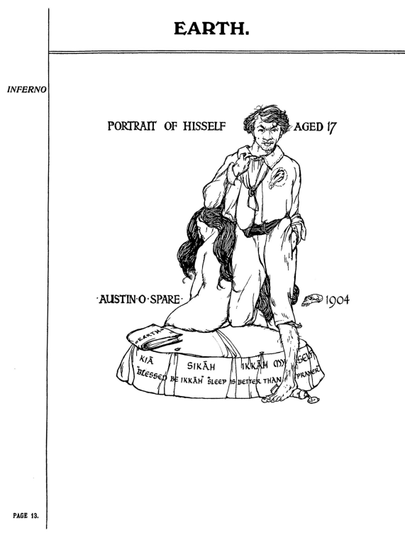
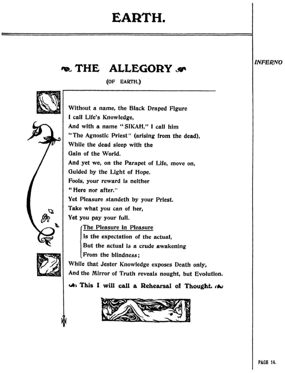
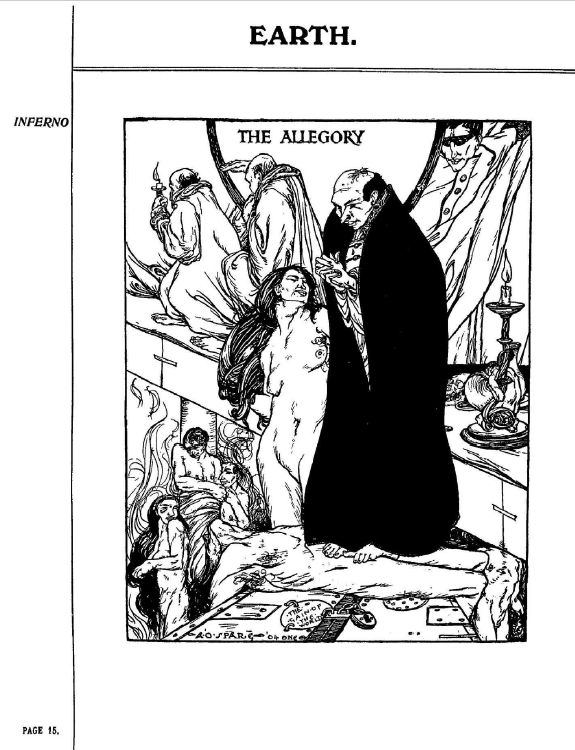
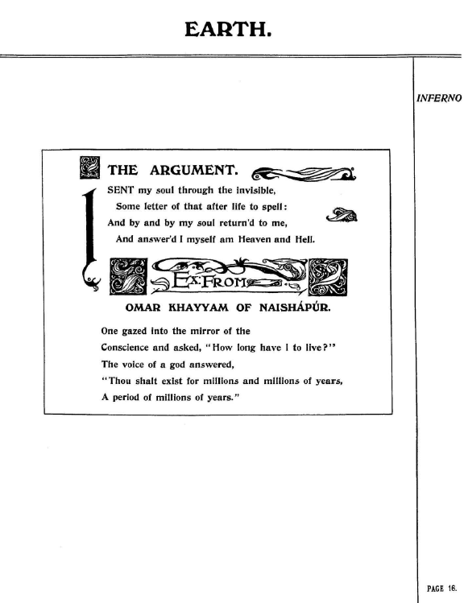
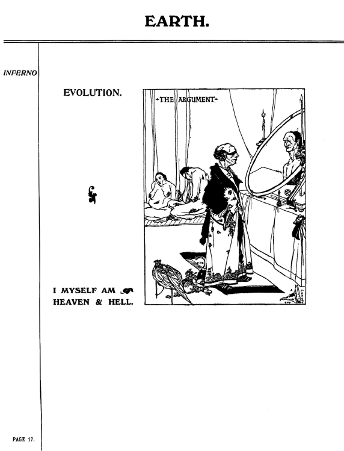

## セクション4

### 🐌 「知られざる呪術師」による注釈

※このセクションは挿絵のみで構成されているため、翻訳・注釈ともに設けていません。

---

## 🇬🇧　原文（原画像）

  
  
  
  
  

---

### 🇯🇵 翻訳と注記

#### p.13： 自画像（17歳）

**PORTRAIT OF HISSELF AGED 17**  
自画像。中央には若きスペアが立ち、足元に横たわる女性とともに描かれる。  
- 足元には「KIA」や「SIKAH」などの語句が円環状に記されている。
- テキストの一部：「BLESSED BE IKKAḤ SLEEP IS BETTER THAN WAKEFULNESS」

**注記**：
- KIAとSIKAHの配置は、スペアの宇宙観における両極の象徴をなす。
- 眠り（無意識）と目覚め（意識）の間にある存在状態を称える構図。

---

#### p.14： 寓話（The Allegory）の詩的テキスト

**要約訳**：
名前なき黒衣の者を「生命の知」と呼び、  
名を与えるならば「SIKAH」――アグノスティックな司祭。  
死者は世界の利益とともに眠るが、我々は希望の光に導かれ歩む。  
愚者よ、報いは此処にも彼方にもない。  
快楽を求めるなら代償を払え。

> 快楽の中の快楽とは  
> 現実への目覚めによって剥がれる幻想の皮膜である。

**注記**：
- 「SIKAH」は死からよみがえる司祭であり、現世的な知識と宗教を揶揄した人物。
- この詩はまさに思考のリハーサル（稽古）として提示される。

---

#### p.15： 寓話の視覚化

**描写**：
- 中央に黒衣の司祭が立ち、裸婦に手をかけている。
- 背後には悔悛する者や性的に倒錯した姿が多く描かれる。

**注記**：
- 欲望、告白、服従、儀式の全てが同一の図に収められ、宗教と性の交差を象徴。
- 黒衣の男は司祭か催眠術師か、あるいはスペア自身の「影」か。

---

#### p.16： The Argument（主張）

**冒頭詩の引用と要約**：
> I sent my soul through the invisible...  
> And answer’d I myself am Heaven and Hell.

自らの魂を見えざる界へ送り、帰ってきた言葉は――  
「私は天国でもあり、地獄でもある」というものであった。

**注記**：
- この詩はオマル・ハイヤームの引用に仮託されているが、内容はスペアの内的ビジョン。
- 自己の内に二元性を統合する象徴的告白。

---

#### p.17： The Argumentの図像

**描写と注記**：
- 鏡の前に立つ人物が、内なる自己を見つめている構図。
- 鏡像の中の人物は年老いており、手前の人物は若い。
- 下部に「I MYSELF AM HEAVEN & HELL」との文字。

> これはスペア流の「鏡の魔術」であり、自己照射と変容の儀式的瞬間。

---

© 2025 知られざる呪術師（Le Sorcier Inconnu）  
本ドキュメントは [Creative Commons BY-SA 4.0](https://creativecommons.org/licenses/by-sa/4.0/deed.ja) に基づき公開されています。
