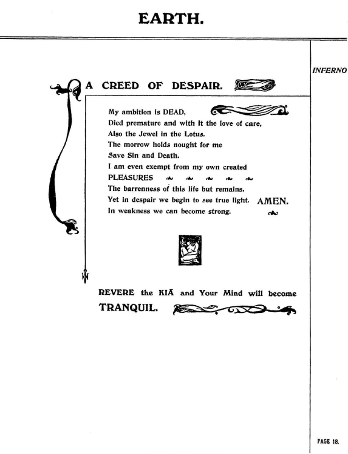
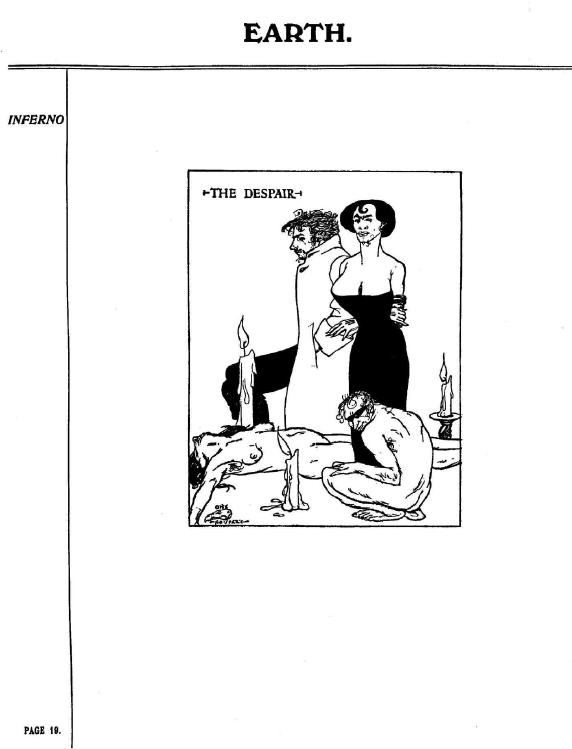
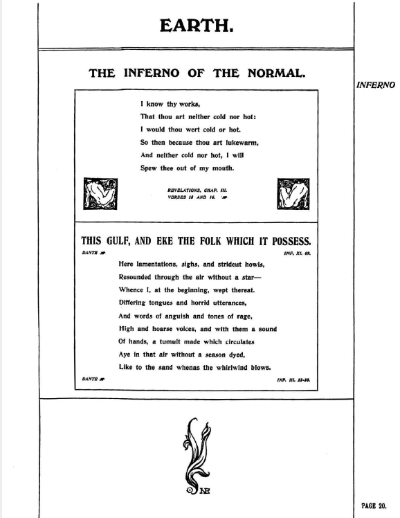
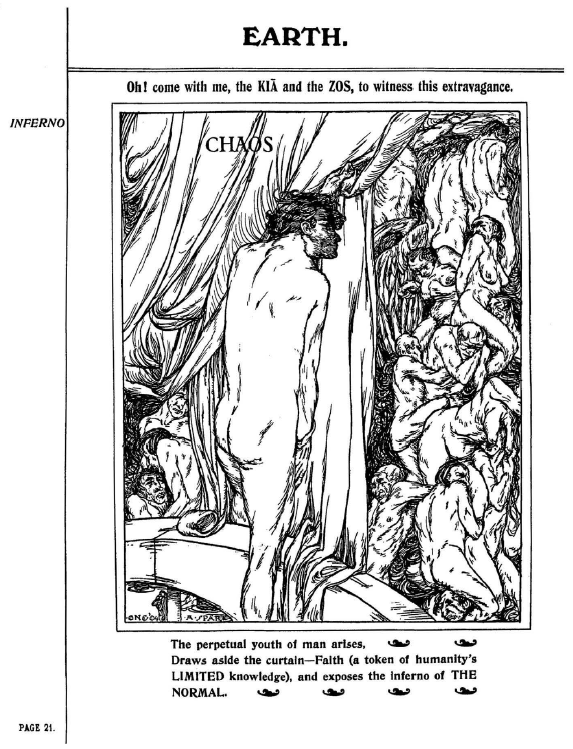

## セクション5

## 🇬🇧　原文（原画像）

  
  
  
  

---

### 🇯🇵 翻訳と注記

#### p.18： A Creed of Despair（絶望の信条）

**日本語訳**：  
絶望の信条（A CREED OF DESPAIR）  
私の野望は死んだ  
早すぎる終焉だった  
それと共に、愛も、思いやりも消えた  
蓮の中の宝珠もまた、消えた  

明日は何も与えてはくれない  
あるのは罪と死だけ  
私自身が創り出した快楽すら  
もはや享受することはできない  

残されたのは  
この人生の不毛さのみ  

されど――  
絶望のうちにこそ、真の光が現れる。アーメン  
弱さの中にこそ、人は力を見いだす  

KIAを敬え、されば、あなたの心は静けさを得るだろう  

**注記**：
- スペアはここで、信仰や希望ではなく、「絶望」こそが目覚めを導くと宣言する
- KIAの言及により、個人的再生の鍵が「神の不在の中の静けさ」にあると示唆している
- 「蓮の中の宝寿（Jewel in the Lotus）」は、悟り＝KIA体験の詩的象徴。『快楽の書』にも登場する

#### p.19： The Despair（視覚化）

**描写と注記**：
- 中央の女性像は凛とし、周囲には苦悶する男性たちが描かれる
- 官能性、無力感、無言の支配構造が混在した光景

> 快楽と苦悩、静けさと混乱が同一空間で共存している。

---

#### p.20： The Inferno of the Normal（通常という地獄）

#### 🕯️ 詩篇の引用と翻訳（ヨハネの黙示録 3:15–16）

> I know thy works,  
> That thou art neither cold nor hot;  
> I would thou wert cold or hot.  
> So then because thou art lukewarm,  
> And neither cold nor hot, I will spew thee out of my mouth.

**あなたの行いを知っている。あなたは冷たくもなく、熱くもない**  
**できることなら、冷たいか熱いかであってほしかった**  
**だが、あなたはぬるく、冷たくも熱くもない**  
**ゆえに、わたしはあなたを口から吐き出そう**

> ☞ 「lukewarm（ぬるさ）」こそが最も忌むべきものとされる。

---

#### 🌀 地獄の前段階（ダンテ『神曲』地獄篇 第3歌 22–30）

> 嘆き、溜息、金切り声が、星なき空をこだまし  
> 私はその始まりから涙した  
> 異なる舌、おぞましい叫び、怒りの声  
> 絶え間なく巡る騒動が、季節なき空に舞い踊る  
> ― まるで砂嵐のように

> ☞ ダンテはここで「無関心な者」＝善にも悪にも加担しなかった者たちの末路を描く。

---

#### 🔍 スペアの核心思想としてのp.20

スペアにとって「中間にいること」＝**生ぬるいこと（lukewarm）**は、最も忌避すべき「地獄的状態」。  
これは単なる宗教批判ではなく、**「選び取らない生き方」そのものへの断罪**である。

スペアの魔術思想においては、この“lukewarm”の拒絶が以下のように発展していく。

| 著作 | 展開される拒絶と反逆 |
|------|------------------|
| 『Earth Inferno』 | 「凡庸さ＝最大の罪」 |
| 『The Book of Pleasure』 | 欲望による宇宙の再構成＝シジル魔術へ |
| 『Anathema of Zos』 | 否定そのものの美学化、ZOSの顕現へ |

## 🧠 総括：「ZOS/KIA思想」の胎動としての1ページ

地上の地獄とは、“自分の道を歩まないこと”である。  
スペアはすでに20代でこの思想に到達していた。  

「lukewarm」という一語が、彼の全魔術体系に通底する  
「選び／否定／創造」の軸をすでに内包している。

---

#### p.21： CHAOS（視覚的カオス）

#### ✍️ 詩的翻訳（原文再構成）

**EARTH**  
おお、来たれ──KIAとZOSと共に  
この奔放なる光景を目撃せよ  

**CHAOS**  
人の永遠なる若者が立ち上がる  
信仰（＝人間の知の限界）というカーテンを引き裂き  
「普通」の地獄（The Inferno of the Normal）をさらけ出す

---

#### 🔍 解説

- **ZOSとKIAの同時登場**：このページで初めて明示的に言及される  
  - ZOS：意志・身体・表現主体（能動）  
  - KIA：観照・超意識・根源存在（受動）
- **Faith（信仰）**：本来「真理」への窓口とされるものを、スペアは「知の限界を覆うカーテン」として描写している
- **「普通」の地獄（INFERNO OF THE NORMAL）**：p.20と連動したキーワード  
  熱意も冷徹さも持たず、ただ従うだけの人生こそ最大の堕落
- **青年の登場**：ZOS＝行為者／目覚めた者のメタファー。意識の覚醒と脱神話化の瞬間

#### 🔑 ページの意義

| 要素 | 意味 |
|------|------|
| ZOSの初出 | ZOS/KIA理論の萌芽点。肉体＝表現装置としての自己の顕現 |
| カーテンを引く青年 | 信仰の終焉と真実の可視化。ZOSの行為性の象徴 |
| CHAOSという見出し | 無秩序ではなく、偽秩序（Faith）を破壊する創造の混沌 |

---

© 2025 知られざる呪術師（Le Sorcier Inconnu）  
本ドキュメントは [Creative Commons BY-SA 4.0](https://creativecommons.org/licenses/by-sa/4.0/deed.ja) に基づき公開されています。
