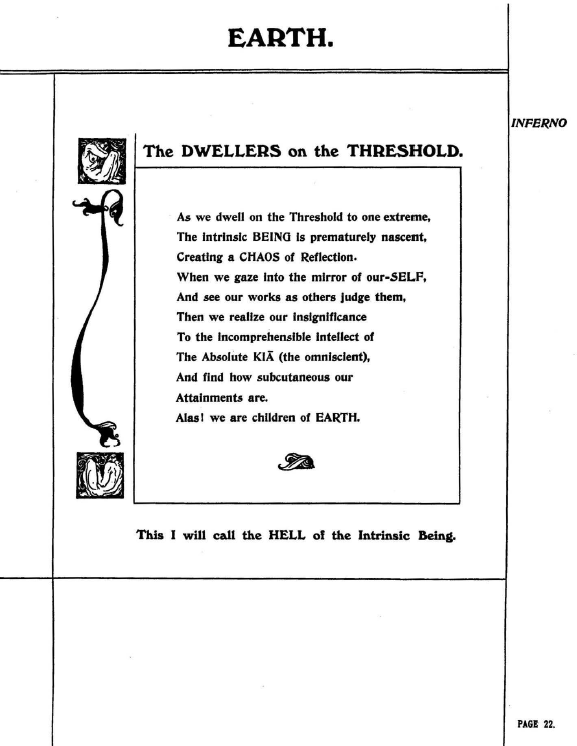
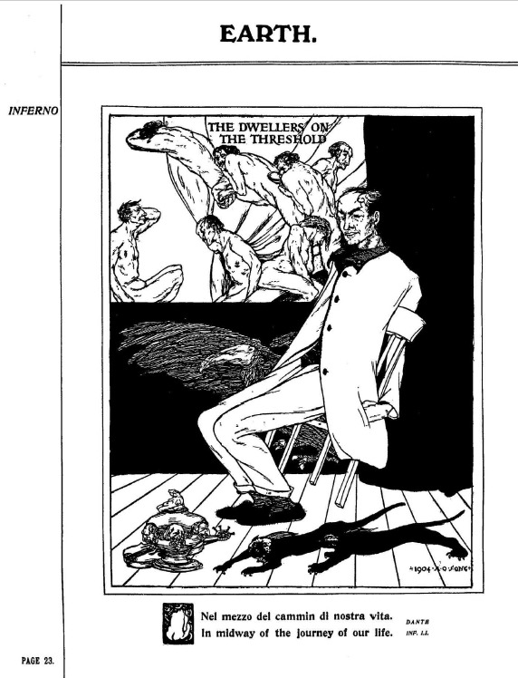
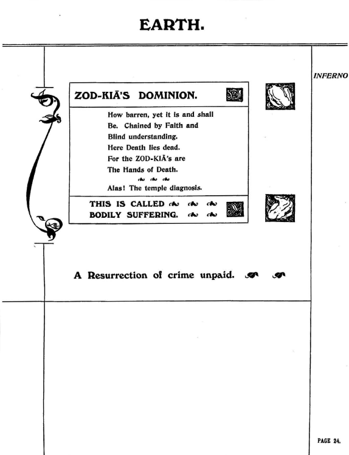

## セクション6

## 🇬🇧　原文（原画像）

  
  
  

---

### 🇯🇵 翻訳と注記

#### p.22： The Dwellers on the Threshold（閾に住む者たち）

#### ✍️ 詩的翻訳

**EARTH**  
**境界に棲まう者たち（The DWELLERS on the THRESHOLD）**

ある極端な地点に我らが佇むとき  
内在する「存在（BEING）」は早熟にして未成熟のまま  
「反映の混沌（CHAOS of Reflection）」**を生み出す  

我らが自己の鏡を覗き込み  
他者の目によって我が行為を裁かれるとき──  
そのとき我らは、自らの取るに足らなさを知るのだ  

全能の絶対者、KIA（キア）の  
理解を超えた知性と向き合い  
そして我らがいかに浅薄で  
いかに取るに足らぬ到達しか得ていないかを思い知る  

ああ、我らは地上（EARTH）の子らである！  

この状態こそ、私は「内在する存在（Intrinsic Being）」にとっての  
地獄（HELL）**と呼ぶだろう

---

#### 🔍 解説

- **“Threshold”**：ここでは精神的・存在論的な「境界」＝目覚めの瀬戸際を意味する
- **“CHAOS of Reflection”**：鏡＝自己認識。そこに生じる混乱と自己の限界への直面
- **KIA**：この詩では「絶対的他者」として登場し、自我と比較されることで「悟りの不可到達性」を強調する
- **地獄とは何か？**  
  宗教的懲罰ではなく、**自己と超越的存在（KIA）とのギャップ**が生む精神的断絶である

---

このページは、後の『快楽の書』に見られる以下の思想の原型をなしている。

- **信仰・知識・自己像の否定**  
- **鏡＝観察される自己からの逸脱**  
- **自己の再構築に向けた“断絶経験”**

> スペアにとって「地獄」とは、未熟な自我がKIAを前にして直面する「見ることの苦しみ」である

---

#### p.23： The Dwellers on the Threshold（視覚表現）

**描写と注記**：
- 頭上には苦悶する人々、中央には白服の人物が沈黙し座っている
- 地面には頭部・仮面・影が散乱している

> 「自己を見失った知識人」、あるいは「制度に呑まれた魂」の具象。

---

#### p.24： ZOD-KIA'S DOMINION（ZOD-KIAの支配領域）

---

#### ✍️ 詩的翻訳

**EARTH**  
**ZOD-KIA’S DOMINION（ZOD-KIAの支配領域）**

いかに不毛であろうとも、それは今あり、これからもあるだろう  
信仰と盲目的理解に縛られ  
死はここで、死に絶えている  

なぜなら、ZOD-KIAのものたちは  
死の手であるからだ  

ああ！これは神殿の診断なのだ  

**THIS IS CALLED BODILY SUFFERING.**  
これは「肉体的苦悩」と呼ばれる  

**A Resurrection of crime unpaid.**  
償われぬ罪の復活である

---

#### 🧠 ZOD-KIA の象徴的構造

- **ZOD-KIA は ZOS-KIA の前身的表現**と考えられるが、より破壊的・死的側面が強調されている
- 本ページでは、**KIA＝霊的中心**に対して、「ZOD-KIA＝堕落した影の原理」として機能している

### 可能な解釈：

1. **ZOD = ZOS + Death（暗喩的複合）**  
   - ZODは肉体（ZOS）に死の属性が加わったものであり、「死の手」としてKIAの逆照射的存在となっている

2. **ZOD = Temple の変奏**  
   - “Temple diagnosis” の語から、**ZODが神殿＝身体の象徴**とも読み取れる。KIA（霊）との緊張関係にある

3. **KIAがZODによって損なわれる構図**  
   - Faith（信仰）やBlind understanding（盲信）によって、本来のKIAが歪められ、苦痛の構造を生む

---

## 🧩 概念マップ：このページの象徴構造

- 信仰と盲信  
  ↓  
- ZOD-KIAによる支配  
  ↓  
- 死の形骸化（「Death lies dead」）  
  ↓  
- 神殿＝身体に宿る「苦悩（Bodily Suffering）」  
  ↓  
- 償われぬ罪の復活（未解決の業／カルマ）

---

© 2025 知られざる呪術師（Le Sorcier Inconnu）  
本ドキュメントは [Creative Commons BY-SA 4.0](https://creativecommons.org/licenses/by-sa/4.0/deed.ja) に基づき公開されています。
