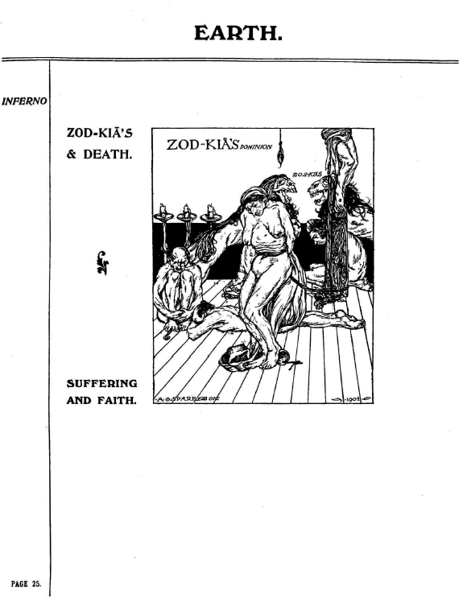
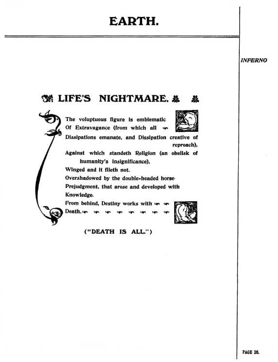

## セクション7

## 🇬🇧　原文（原画像）

  
  
  

---

### 🇯🇵 翻訳と注記

#### p.25： ZOD-KIA’S & DEATH（ゾッド＝キアと死）

**描写と注記**：
- 中央に女性の裸体、その周囲に跪く人物たち、背後には拷問的器具。
- 「信仰と苦悶」が交差する構図。

> 宗教的幻想に支配された性と死の儀式空間を描く。  
> KIAの暗黒面であるZOD-KIAの支配が、信仰の名のもとに身体を拘束する。

---

#### p.26： LIFE’S NIGHTMARE（人生の悪夢）

**詩の要約訳**：
肉体的享楽の象徴は、堕落と浪費を象徴する。  
宗教（人間の矮小性の記念碑）は翼を持たず飛ばず、  
知識と偏見に覆い隠されている。  
背後では運命が死をもって働いている。  
> 「死こそすべてである」

**注記**：
- スペアはここで、**享楽と宗教、知識と死**の連関を皮肉的に語る。
- 人生の悪夢＝文明そのものの構造的堕落。

---

#### p.27： A REHEARSAL OF DESPAIR（絶望のリハーサル）

**描写と注記**：
- 周囲に書かれた単語：浪費・非難・偏見・堕落・快楽・冒涜・暴食・運命と死…
- 絡み合う裸体と錯綜した視線は、欲望の檻に囚われた人間の姿を強調する。

> 絶望のリハーサルとは、終わりなき退廃の模倣劇。  
> 観察される者は「芸術」ではなく「展示物」である。

---

© 2025 知られざる呪術師（Le Sorcier Inconnu）  
本ドキュメントは [Creative Commons BY-SA 4.0](https://creativecommons.org/licenses/by-sa/4.0/deed.ja) に基づき公開されています。
