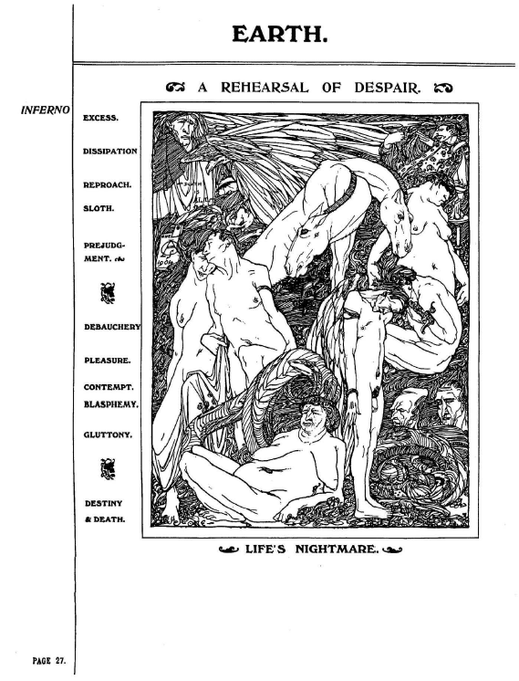

## セクション7：人間動物園／芸術と売春

## 🇬🇧　原文（原画像）

  
  
  

---

#### セクション7：人間動物園／芸術と売春

**タイトルの由来：** 享楽・放蕩・先入観・堕落などが視覚的に分類され、人間が展示・消費される“芸術の牢獄”が表現されているため。

**主な根拠：**
- 画像：p.27「A REHEARSAL OF DESPAIR」──「人生の悪夢」として並ぶ裸体たち
- テキスト：p.26「LIFE’S NIGHTMARE」──運命と死が背後から迫る詩
  
---

### 🇯🇵 翻訳と注記

#### p.25： ZOD-KIA’S & DEATH（ゾッド＝キアと死）

**描写と注記**
- 中央に女性の裸体、その周囲に跪く人物たち、背後には拷問的器具
- 「信仰と苦悶」が交差する構図

> 宗教的幻想に支配された性と死の儀式空間を描く。  
> KIAの暗黒面であるZOD-KIAの支配が、信仰の名のもとに身体を拘束する。

---

#### p.26： LIFE’S NIGHTMARE（人生の悪夢）

**日本語訳**

この官能的な姿は  
すべての放蕩の源である「過剰」の象徴である  
放蕩は散逸を生み  
放蕩はまた、咎を生む奔放さを呼び込む  

それに対抗して立つのは宗教──  
人間の取るに足らなさを象徴する「記念碑」  
宗教には翼がなく、どこへも飛べはしない  

その上に影を落とすのは、  
「知識」によって育てられた先入観という  
双頭の馬である  

背後では、運命が「死」とともに働きかけてくる  

**死こそがすべて。**

**注記**
- スペアはここで、**享楽と宗教、知識と死**の連関を皮肉的に語る
- 人生の悪夢＝文明そのものの構造的堕落である

---

#### p.27： A REHEARSAL OF DESPAIR（絶望の予行演習）

**EARTH**  

EXCESS ─ 過剰  
DISSIPATION ─ 放蕩  
REPROACH ─ 非難  
SLOTH ─ 怠惰  
PREJUDGMENT, etc. ─ 先入観など  
DEBAUCHERY ─ 退廃  
PLEASURE ─ 快楽  
CONTEMPT,  
BLASPHEMY. ─ 侮蔑、冒涜  
GLUTTONY. ─ 貪欲  
DESTINY & DEATH. ─ 運命と死  

**人生の悪夢（LIFE'S NIGHTMARE）**

---

#### 🧠 注釈メモ

このページは、まさにスペアが視覚化した「内面世界における堕落と崩壊の構図」であり、  
キリスト教的「七つの大罪」の構造を脱構築しつつ、彼自身の世界観に再統合している。

- 各語彙は地獄的状態のレイヤーを構成し、人間の精神的・肉体的退廃を並列で提示している
- "REHEARSAL"（予行演習）という語が皮肉的で、**堕落の繰り返しが“日常”の地獄化**であることを暗示する
- 最後に「LIFE'S NIGHTMARE（人生の悪夢）」が再登場することで、p.26との思想的接続が強調されている

> スペアの地獄とは「咎の体系化された再演」＝絶望のリハーサルである。

> 絶望のリハーサルとは、終わりなき退廃の模倣劇である。  
> 観察される者は「芸術」ではなく「展示物」である。

---

© 2025 知られざる呪術師（Le Sorcier Inconnu）  
本ドキュメントは [Creative Commons BY-SA 4.0](https://creativecommons.org/licenses/by-sa/4.0/deed.ja) に基づき公開されています。
