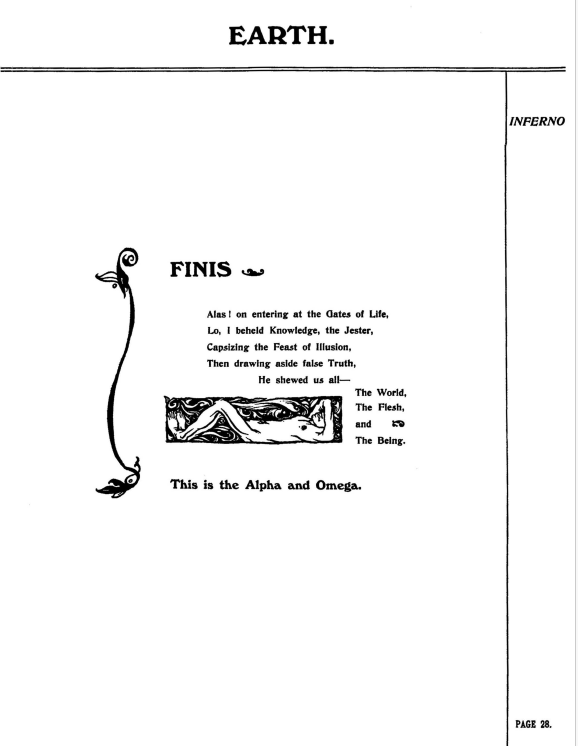
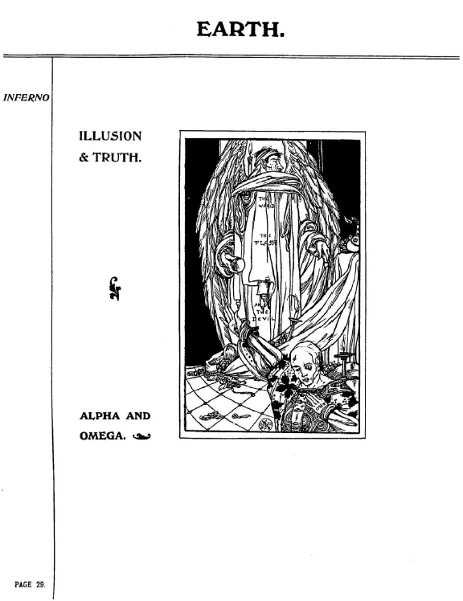
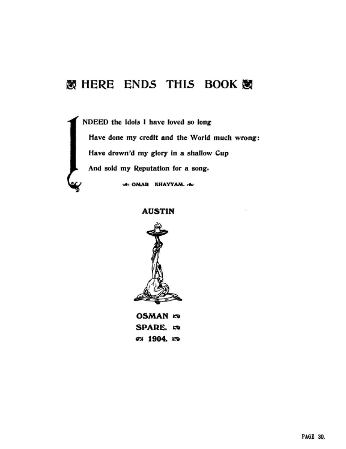
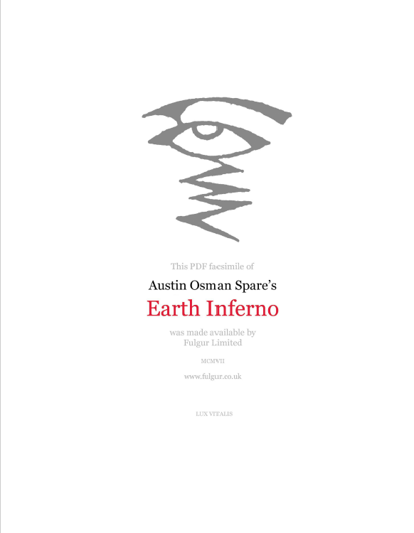

## セクション8

## 🇬🇧　原文（原画像）

  
  
  
  

---

### 🇯🇵 翻訳と注記

#### p28： FINIS（終章）

**日本語訳**  

ああ、命の門へと足を踏み入れたとき  
見よ、私は「知」と「道化」を目にした──  
幻想の饗宴を茶化しながら  
やがて偽りの「真理」の帳を引き剥がし  
彼は我らに見せた──  
**世界（The World）**、  
**肉（The Flesh）**  
そして **存在（The Being）** を  

**これがアルファであり、オメガである。**  
（This is the Alpha and Omega.）

---

#### 🧠 注釈

- 「知」と「道化」はスペアにとっての**真理の媒介者＝破壊者**  
  真理は厳かではなく、むしろ**茶化し（嘲笑）によって開示される**
- 「幻想の饗宴」＝この世的価値のパロディ  
  「真理の帳」は宗教的権威や倫理体系の象徴
- 最後に提示される「世界・肉・存在」の三語は、スペアにおける**現象／物質／根源**の三位一体
- 「This is the Alpha and Omega」は**始まりと終わり、自己と宇宙の合一、永劫的円環**を象徴する句

> スペアの終幕は「新たな始まり」であり、ZOS/KIA体系の神話的構造の中核でもある。

この一節はZine全体の締めにふさわしく、円環的宇宙観の詩的宣言ともいえる。

---

#### p.29： ILLUSION & TRUTH（視覚構図）

**描写と注記**
- 大きな布のようなものが垂れ下がり、中央には「Truth」と刻まれた碑  
- 前景には頭蓋骨や倒れた人物、背後には荘厳な影

> 「真実」は死の象徴とともに立ち上がり、幻想の幕が裂ける。  
> 視線は「終末」と「啓示」の交錯を映し出す。

---

#### p.30： HERE ENDS THIS BOOK（この書の終わり）

#### ✍️ 詩句訳（オマル・ハイヤーム『ルバイヤート』より）

> INDEED the Idols I have loved so long  
> Have done my credit and the World much wrong:  
> Have drown’d my glory in a shallow Cup  
> And sold my Reputation for a song.

たしかに、長年愛してきた偶像たちは  
私の信用と、この世界に大いなる損失をもたらした  
私の栄光は浅き杯に沈み  
その名誉は一曲の歌と引き換えに売り払われた

> ※『ルバイヤート』からの引用。スペアの諦念と美学がにじむ選定であり、  
> 自身の芸術人生の虚無と栄光の矛盾を静かに示している。

---

#### 🖋️ 奥付情報

**AUSTIN OSMAN SPARE. 1904.**

この署名と出版年は、スペアが本書を**20歳で自費出版**した事実を証明する。  
彼の初期ヴィジョンが、すでに完全な芸術と哲学として完成していたことを示す記録。

---

#### p.31： Fulgur社のファクシミリ情報

※ 2025年現在、パブリックドメインとなっているが、Fulgur Limited によって再出版された版のPDFである旨が記載されている。

---

© 2025 知られざる呪術師（Le Sorcier Inconnu）  
本ドキュメントは [Creative Commons BY-SA 4.0](https://creativecommons.org/licenses/by-sa/4.0/deed.ja) に基づき公開されています。
